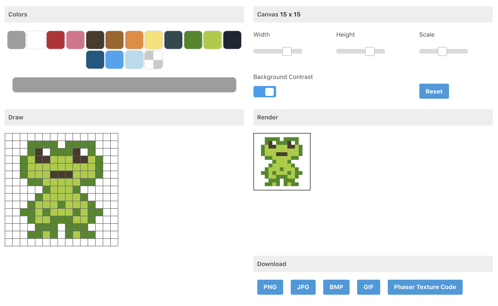

# Phaser Pixel Generator
A fun project integrating [Phaser](https://phaser.io/) texture generating into a pixel image creator.



## Demo

[See Demo](https://dqsmith.github.io/phaser-pixel-generator/)

## Get Started

Clone the repo and install the dependencies.

```
npm i
```

Start the application.

```
npm start
```

Build the application

```
npm run build
```
